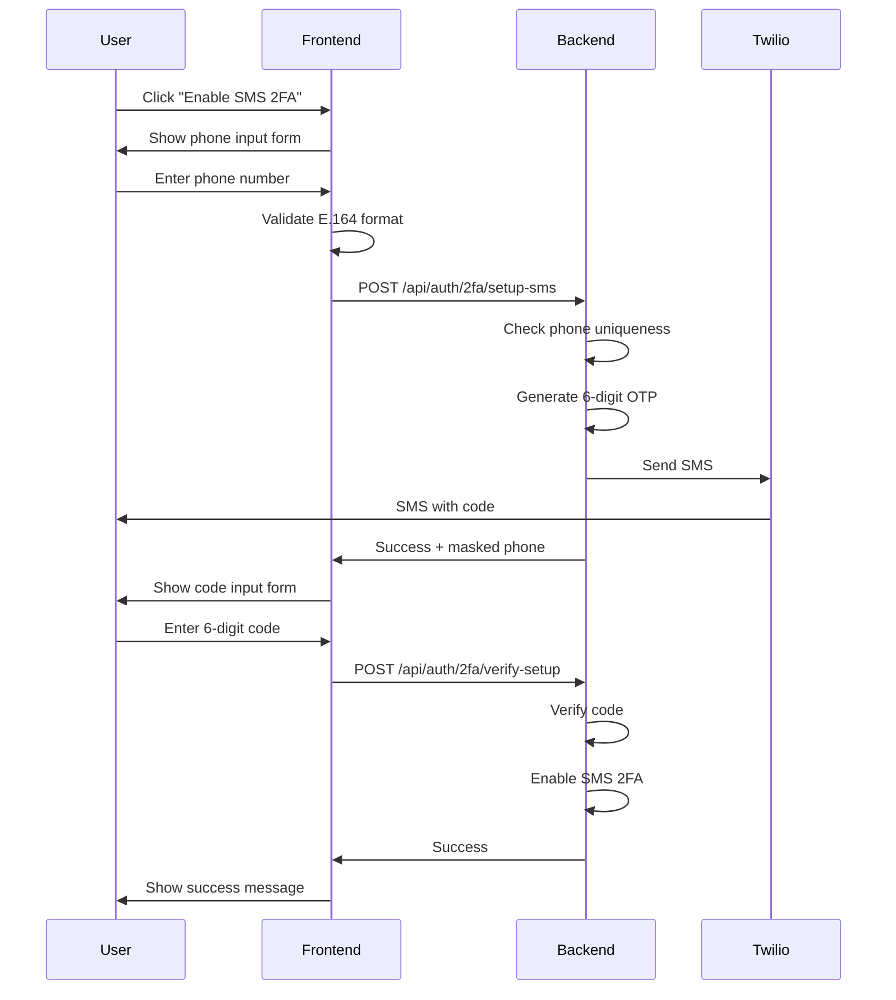
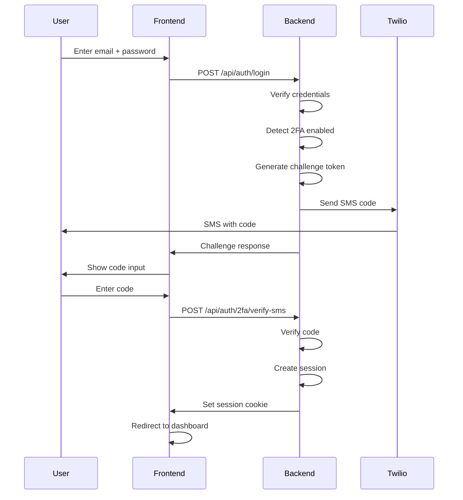
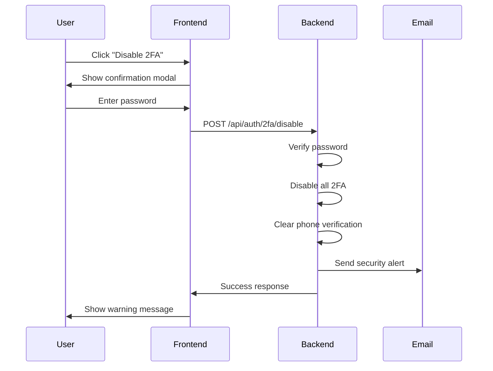

# Frontend Integration Guide: SMS 2FA Flow - Part 2

## 📋 Classification: 🌐 SHARED
**Module:** SMS Two-Factor Authentication (Continued)  
**Part:** 2 of 3

---

## 📡 API Endpoints (Continued)

## 5️⃣ Disable SMS 2FA

### `POST /api/auth/2fa/disable`

Disables all two-factor authentication methods for the user's account, including SMS. Requires password confirmation for security.

> ⚠️ **Important**: This endpoint disables **ALL** 2FA methods (both SMS and TOTP), not just SMS. If you need to remove only one method while keeping another, use the `/api/auth/2fa/remove-method` endpoint instead.

#### Authentication
✅ **Required** - User must be authenticated

#### Request Schema

```typescript
interface DisableTwoFactorRequest {
  password: string; // User's current password
  code?: string;    // Optional: 6-digit TOTP code if TOTP is enabled
}
```

#### Request Example

```typescript
const response = await fetch('/api/auth/2fa/disable', {
  method: 'POST',
  credentials: 'include',
  headers: { 'Content-Type': 'application/json' },
  body: JSON.stringify({
    password: 'user_current_password',
  }),
});

const data = await response.json();
```

#### Success Response (200 OK)

```typescript
interface DisableTwoFactorResponse {
  success: true;
  data: {
    enabled: false;
    message: string;
    warning: string;
    securityNote: string;
    details: {
      totpDisabled: boolean;
      smsDisabled: boolean;
      backupCodesRemoved: boolean;
    };
  };
}
```

**Example:**
```json
{
  "success": true,
  "data": {
    "enabled": false,
    "message": "Two-factor authentication has been disabled for your account",
    "warning": "Your account is now less secure. We strongly recommend re-enabling two-factor authentication.",
    "securityNote": "A security alert has been sent to your email address.",
    "details": {
      "totpDisabled": true,
      "smsDisabled": true,
      "backupCodesRemoved": true
    }
  }
}
```

#### Error Responses

| Status | Error Code | Message | Description |
|--------|-----------|---------|-------------|
| 400 | `VALIDATION_ERROR` | Invalid request data | Missing or invalid password |
| 401 | `UNAUTHORIZED` | You must be logged in | User not authenticated |
| 401 | `INVALID_CURRENT_PASSWORD` | Current password is incorrect | Password verification failed |
| 404 | `USER_NOT_FOUND` | User not found | User doesn't exist |
| 500 | `INTERNAL_SERVER_ERROR` | Failed to disable two-factor authentication | Server error |

#### Validation Rules

**Password:**
- ✅ Required field
- ✅ Must match user's current password
- ❌ No format validation (any non-empty string accepted)

**Frontend Validation:**
```typescript
export const disableTwoFactorSchema = z.object({
  password: z.string().min(1, 'Password is required'),
  code: z.string().length(6).regex(/^\d{6}$/).optional(),
});
```

#### Business Logic Notes

1. **Security Confirmation**: Password verification is required to prevent unauthorized 2FA disabling.

2. **Complete Cleanup**: When disabled:
   - `two_factor_enabled` set to `false`
   - `two_factor_secret` cleared (TOTP secret removed)
   - `phone_verified` set to `false`
   - `preferred_2fa_method` cleared
   - All backup codes deleted

3. **Email Notification**: A security alert email is automatically sent to the user's registered email address.

4. **Audit Logging**: This action is logged in the audit trail with user context (IP, user agent).

---

## 6️⃣ Login Challenge Flow (SMS Verification)

### Step 1: Initial Login → Triggers 2FA Challenge

When a user with SMS 2FA enabled logs in with correct credentials, the login endpoint returns a challenge token instead of a session.

**Login Response with 2FA Challenge:**
```typescript
interface LoginWithChallengeResponse {
  success: true;
  requires2FA: true;
  challengeToken: string; // Token to use for verification
  method: 'SMS' | 'AUTHENTICATOR' | 'BOTH';
  maskedPhone?: string; // Only for SMS method
  message: string;
  expiresIn: number; // Seconds until challenge expires (600 = 10 minutes)
}
```

**Example Response:**
```json
{
  "success": true,
  "requires2FA": true,
  "challengeToken": "eyJhbGciOiJIUzI1NiIsInR5cCI6IkpXVCJ9...",
  "method": "SMS",
  "maskedPhone": "***8901",
  "message": "A verification code has been sent to your phone",
  "expiresIn": 600
}
```

---

### Step 2: Verify SMS Code

### `POST /api/auth/2fa/verify-sms`

Validates the SMS OTP code during login and completes authentication.

#### Authentication
❌ **Not Required** - This is part of the login flow (before session created)

#### Request Schema

```typescript
interface VerifySmsLoginRequest {
  challengeToken: string; // From login response
  code: string;          // 6-digit SMS code
}
```

#### Request Example

```typescript
const response = await fetch('/api/auth/2fa/verify-sms', {
  method: 'POST',
  headers: { 'Content-Type': 'application/json' },
  body: JSON.stringify({
    challengeToken: 'eyJhbGc...', // From login response
    code: '123456',
  }),
});

const data = await response.json();
```

#### Success Response (200 OK)

```typescript
interface VerifySmsLoginResponse {
  success: true;
  data: {
    message: string;
  };
}
```

**Example:**
```json
{
  "success": true,
  "data": {
    "message": "Two-factor authentication successful"
  }
}
```

> **Note**: Upon successful verification, the backend will set the session cookie automatically. The frontend should redirect to the dashboard/home page.

#### Error Responses

| Status | Error Code | Message | Description |
|--------|-----------|---------|-------------|
| 400 | `VALIDATION_ERROR` | Invalid request data | Code format invalid or challenge token missing |
| 401 | `VERIFICATION_FAILED` | Invalid verification code | Code incorrect |
| 403 | `VERIFICATION_FAILED` | Maximum verification attempts exceeded | Too many failed attempts |
| 410 | `VERIFICATION_FAILED` | Challenge has expired | Challenge token expired (>10 minutes old) |
| 429 | `VERIFICATION_FAILED` | Too many verification attempts | Rate limit exceeded |

**Detailed Error Response:**
```typescript
interface VerificationErrorResponse {
  success: false;
  error: {
    code: 'VERIFICATION_FAILED';
    message: string;
    attemptsRemaining?: number; // Only if not locked
    lockedUntil?: string;      // ISO timestamp if locked
  };
}
```

**Example Error:**
```json
{
  "success": false,
  "error": {
    "code": "VERIFICATION_FAILED",
    "message": "Invalid verification code",
    "attemptsRemaining": 2
  }
}
```

#### Validation Rules

**Challenge Token:**
- ✅ Required
- ✅ Must be valid JWT token from login response
- ✅ Must not be expired (10-minute TTL)

**Code:**
- ✅ Must be exactly 6 digits
- ✅ Numeric only
- ✅ Must match the code sent via SMS
- ✅ Must be verified within 5 minutes of SMS send

**Frontend Validation:**
```typescript
export const verifySmsLoginSchema = z.object({
  challengeToken: z.string().min(1, 'Challenge token is required'),
  code: z.string().length(6, 'Code must be 6 digits').regex(/^\d{6}$/),
});
```

#### Business Logic Notes

1. **Attempt Limits**:
   - Maximum 5 verification attempts per challenge
   - After 5 failed attempts, challenge is invalidated
   - User must restart login process

2. **Rate Limiting**:
   - Maximum 5 attempts per 15-minute window
   - After exceeding limit, user is temporarily locked

3. **Challenge Expiration**:
   - Challenge token expires after 10 minutes
   - SMS code expires after 5 minutes
   - If either expires, user must restart login

4. **Account Lockout**:
   - After 10 total failed 2FA attempts, account is locked
   - Lockout duration increases with repeated failures
   - User receives email notification

5. **Session Creation**:
   - Upon successful verification, session is created automatically
   - Session cookie is set in response headers
   - Frontend should redirect to protected route

---

## 7️⃣ Resend SMS Code (During Login)

### `POST /api/auth/2fa/resend-sms`

Resends the SMS verification code during the login challenge flow.

#### Authentication
❌ **Not Required** - Part of login flow

#### Request Schema

```typescript
interface ResendSmsRequest {
  challengeToken: string;
}
```

#### Request Example

```typescript
const response = await fetch('/api/auth/2fa/resend-sms', {
  method: 'POST',
  headers: { 'Content-Type': 'application/json' },
  body: JSON.stringify({
    challengeToken: 'eyJhbGc...',
  }),
});

const data = await response.json();
```

#### Success Response (200 OK)

```typescript
interface ResendSmsResponse {
  success: true;
  data: {
    message: string;
    remainingAttempts: number;
  };
}
```

**Example:**
```json
{
  "success": true,
  "data": {
    "message": "Verification code has been resent",
    "remainingAttempts": 2
  }
}
```

#### Error Responses

| Status | Error Code | Message | Description |
|--------|-----------|---------|-------------|
| 400 | `VALIDATION_ERROR` | Invalid request data | Challenge token missing |
| 400 | `RESEND_FAILED` | Challenge has expired | Challenge token expired |
| 410 | `RESEND_FAILED` | Challenge has expired | Challenge no longer valid |
| 429 | `RATE_LIMIT_EXCEEDED` | Too many verification attempts | Resend limit exceeded |

**Rate Limit Error:**
```typescript
interface ResendRateLimitError {
  success: false;
  error: {
    code: 'RATE_LIMIT_EXCEEDED';
    message: string;
    resetAt: string; // ISO timestamp
    remainingAttempts: number;
  };
}
```

#### Rate Limiting

**Resend Limits:**
- Maximum 3 resend requests per challenge
- Progressive backoff between resends:
  - 1st resend: 30 seconds wait
  - 2nd resend: 60 seconds wait
  - 3rd+ resend: 120 seconds wait

**Frontend Implementation:**
```typescript
interface ResendState {
  canResend: boolean;
  waitSeconds: number;
  attemptsRemaining: number;
}

function calculateResendWait(attemptNumber: number): number {
  const backoffMap = [0, 30, 60, 120];
  return backoffMap[Math.min(attemptNumber, backoffMap.length - 1)];
}

// Usage in component
const [resendState, setResendState] = useState<ResendState>({
  canResend: true,
  waitSeconds: 0,
  attemptsRemaining: 3,
});

const handleResend = async () => {
  const response = await resendSms(challengeToken);
  
  if (response.success) {
    const attemptNumber = 3 - response.data.remainingAttempts + 1;
    const waitTime = calculateResendWait(attemptNumber);
    
    setResendState({
      canResend: false,
      waitSeconds: waitTime,
      attemptsRemaining: response.data.remainingAttempts,
    });
    
    // Start countdown timer
    startCountdown(waitTime);
  }
};
```

---

## 📊 Rate Limiting Summary

### Per-User Rate Limits

| Action | Limit | Window | Consequence |
|--------|-------|--------|-------------|
| **SMS Setup/Send** | 3 SMS | 15 minutes | Rate limit error, must wait |
| **Code Verification** | 5 attempts | Per challenge | Challenge invalidated |
| **Challenge Initiation** | 10 challenges | 15 minutes | Rate limit error |
| **Resend SMS** | 3 resends | Per challenge | Must restart login |
| **Failed 2FA Verifications** | 5 attempts | 15 minutes | Rate limit warning |
| **Total Failed 2FA** | 10 attempts | Rolling | Account lockout |

### Rate Limit Response Headers

The backend does not currently return rate limit headers, but tracks limits internally.

**Recommended Frontend Tracking:**
```typescript
interface RateLimitTracker {
  action: string;
  count: number;
  resetAt: Date;
}

// Store in localStorage or state
const trackRateLimit = (action: string, resetAt: Date) => {
  const tracker: RateLimitTracker = {
    action,
    count: 1,
    resetAt,
  };
  localStorage.setItem(`rateLimit:${action}`, JSON.stringify(tracker));
};
```

---

## 🔄 Complete User Flows

### Flow 1: Enable SMS 2FA



### Flow 2: Login with SMS 2FA



### Flow 3: Disable SMS 2FA



---

Continue to **[Part 3](./FRONTEND_INTEGRATION_SMS_2FA_PART_3.md)** for:
- Complete TypeScript type definitions
- Error handling strategies
- React implementation examples
- Frontend checklist
