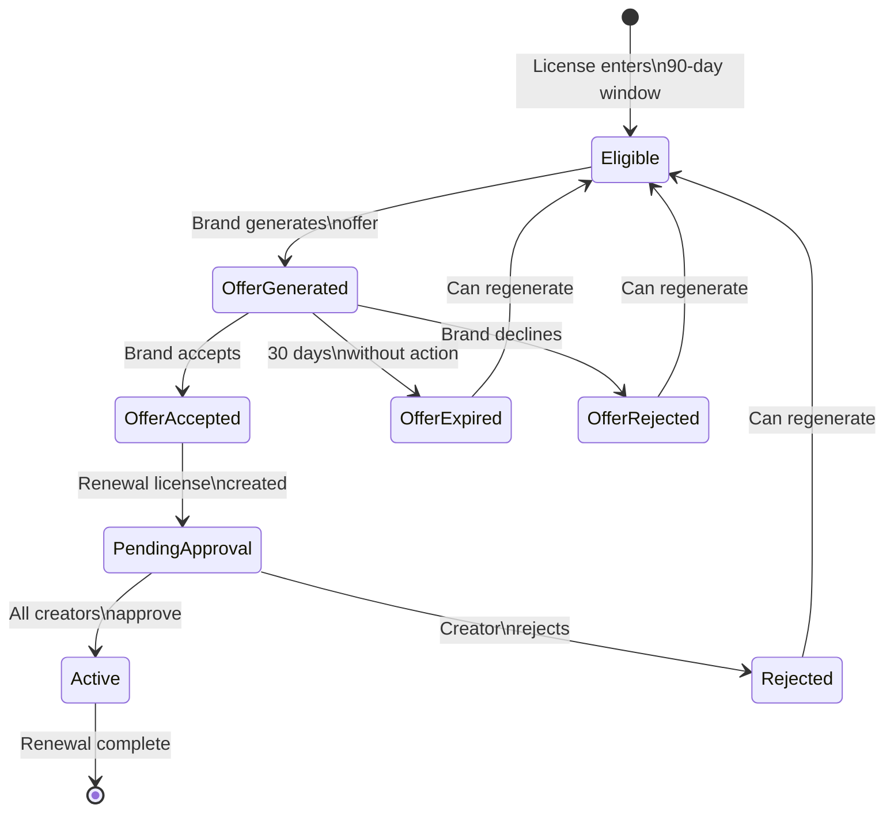

# Frontend Integration Guide: License Renewal System - Part 2: Business Logic & Workflows

**Classification:** ⚡ HYBRID  
**Target Audience:** Frontend developers building UI for YesGoddess  
**Last Updated:** October 14, 2025

---

## Table of Contents

1. [Business Logic & Validation Rules](#business-logic--validation-rules)
2. [Pricing Strategies Explained](#pricing-strategies-explained)
3. [State Machine & Workflows](#state-machine--workflows)
4. [Notification System](#notification-system)
5. [Auto-Renewal Logic](#auto-renewal-logic)
6. [UI/UX Considerations](#uiux-considerations)

---

## Business Logic & Validation Rules

### Renewal Eligibility Rules

The frontend should enforce these rules before allowing users to generate renewal offers:

#### ✅ Required Conditions (Blocking)

1. **Renewal Window**
   - License must be within 90 days of expiration
   - OR within 30 days AFTER expiration (grace period)
   - Formula: `-30 days <= daysUntilExpiration <= 90 days`

2. **License Status**
   - Must be: `ACTIVE`, `EXPIRING_SOON`, or `EXPIRED`
   - Cannot renew: `DRAFT`, `PENDING_APPROVAL`, `PENDING_SIGNATURE`, `TERMINATED`, `SUSPENDED`, `RENEWED`

3. **No Active Renewals**
   - License cannot already have a renewal in progress
   - Check `license.renewals` array for statuses: `ACTIVE`, `PENDING_APPROVAL`, `PENDING_SIGNATURE`, `DRAFT`

4. **IP Asset Active**
   - `ipAsset.deletedAt` must be `null`

5. **Active Ownership**
   - At least one creator must have active ownership
   - Check: `ownership.endDate` is `null` OR `endDate > now`

6. **Brand Account Active**
   - `brand.deletedAt` must be `null`
   - `brand.user.isActive` must be `true`
   - `brand.user.deleted_at` must be `null`

7. **No Conflicting Licenses**
   - Proposed renewal dates cannot conflict with other licenses for same IP asset
   - System checks this automatically, but display warning if conflicts exist

#### ⚠️ Warning Conditions (Non-blocking)

1. **Ownership Changes**
   - If IP ownership has changed since original license, manual review may be needed
   - Display warning: "Creator ownership has changed. Review required."

2. **Inactive Creators**
   - If any creators are inactive (`creator.user.isActive = false`)
   - Display warning: "Some creators are inactive. Manual approval required."

3. **No Billing Info**
   - If `brand.billingInfo` is `null`
   - Display warning: "Payment information required before renewal."

4. **Payment Issues**
   - If brand has failed payments or disputes
   - Display warning: "Resolve payment issues before renewing."

5. **Active Disputes**
   - If there are active ownership disputes on the IP asset
   - Display warning: "Active disputes exist. May delay renewal approval."

### Field Validation

#### Generate Renewal Offer

```typescript
// Validation rules
const validateGenerateOffer = (input: {
  licenseId: string;
  pricingStrategy?: PricingStrategy;
  customAdjustmentPercent?: number;
}) => {
  const errors: string[] = [];

  // License ID
  if (!input.licenseId || !input.licenseId.match(/^cl[a-z0-9]{24}$/)) {
    errors.push('Invalid license ID format');
  }

  // Pricing strategy
  const validStrategies = [
    'FLAT_RENEWAL',
    'USAGE_BASED',
    'MARKET_RATE',
    'PERFORMANCE_BASED',
    'NEGOTIATED',
    'AUTOMATIC'
  ];
  
  if (input.pricingStrategy && !validStrategies.includes(input.pricingStrategy)) {
    errors.push('Invalid pricing strategy');
  }

  // Custom adjustment (only for NEGOTIATED strategy)
  if (input.pricingStrategy === 'NEGOTIATED') {
    if (input.customAdjustmentPercent === undefined) {
      errors.push('Custom adjustment percentage required for NEGOTIATED strategy');
    } else if (
      input.customAdjustmentPercent < -100 ||
      input.customAdjustmentPercent > 100
    ) {
      errors.push('Custom adjustment must be between -100% and +100%');
    }
  }

  return errors;
};
```

#### Accept Renewal Offer

```typescript
const validateAcceptOffer = (input: {
  licenseId: string;
  offerId: string;
}) => {
  const errors: string[] = [];

  if (!input.licenseId || !input.licenseId.match(/^cl[a-z0-9]{24}$/)) {
    errors.push('Invalid license ID format');
  }

  if (!input.offerId || !input.offerId.startsWith('renewal-offer-')) {
    errors.push('Invalid offer ID format');
  }

  return errors;
};
```

### Calculations & Derived Values

#### Display Pricing Breakdown

```typescript
// Format pricing for display
const formatPricingBreakdown = (pricing: RenewalPricingBreakdown) => {
  return {
    // Original price
    originalPrice: `$${(pricing.originalFeeCents / 100).toLocaleString('en-US', {
      minimumFractionDigits: 2,
      maximumFractionDigits: 2
    })}`,

    // New price
    finalPrice: `$${(pricing.finalFeeCents / 100).toLocaleString('en-US', {
      minimumFractionDigits: 2,
      maximumFractionDigits: 2
    })}`,

    // Change amount
    changeAmount: `${pricing.comparison.absoluteChangeCents >= 0 ? '+' : ''}$${
      Math.abs(pricing.comparison.absoluteChangeCents / 100).toLocaleString('en-US', {
        minimumFractionDigits: 2,
        maximumFractionDigits: 2
      })
    }`,

    // Change percentage
    changePercentage: `${pricing.comparison.percentChange >= 0 ? '+' : ''}${
      pricing.comparison.percentChange.toFixed(2)
    }%`,

    // Rev share
    revShare: `${(pricing.finalRevShareBps / 100).toFixed(2)}%`,

    // Adjustments formatted
    adjustments: pricing.adjustments.map(adj => ({
      ...adj,
      formattedAmount: `${adj.amountCents >= 0 ? '+' : ''}$${
        Math.abs(adj.amountCents / 100).toLocaleString('en-US', {
          minimumFractionDigits: 2
        })
      }`,
      formattedPercent: `${adj.percentChange >= 0 ? '+' : ''}${adj.percentChange.toFixed(2)}%`
    }))
  };
};
```

#### Calculate Days Until Expiration

```typescript
import { differenceInDays, format } from 'date-fns';

const getRenewalStatus = (license: License) => {
  const now = new Date();
  const daysUntilExpiration = differenceInDays(license.endDate, now);

  if (daysUntilExpiration < -30) {
    return {
      status: 'EXPIRED',
      message: 'License expired beyond grace period',
      variant: 'error',
      canRenew: false
    };
  }

  if (daysUntilExpiration < 0) {
    return {
      status: 'GRACE_PERIOD',
      message: `Expired ${Math.abs(daysUntilExpiration)} days ago (grace period)`,
      variant: 'warning',
      canRenew: true
    };
  }

  if (daysUntilExpiration <= 7) {
    return {
      status: 'URGENT',
      message: `Expires in ${daysUntilExpiration} day${daysUntilExpiration !== 1 ? 's' : ''}`,
      variant: 'error',
      canRenew: true,
      urgencyLevel: 'final'
    };
  }

  if (daysUntilExpiration <= 30) {
    return {
      status: 'EXPIRING_SOON',
      message: `Expires in ${daysUntilExpiration} days`,
      variant: 'warning',
      canRenew: true,
      urgencyLevel: 'high'
    };
  }

  if (daysUntilExpiration <= 60) {
    return {
      status: 'RENEWAL_WINDOW',
      message: `Expires in ${daysUntilExpiration} days`,
      variant: 'info',
      canRenew: true,
      urgencyLevel: 'medium'
    };
  }

  if (daysUntilExpiration <= 90) {
    return {
      status: 'RENEWAL_AVAILABLE',
      message: `Expires ${format(license.endDate, 'MMM d, yyyy')}`,
      variant: 'info',
      canRenew: true,
      urgencyLevel: 'medium'
    };
  }

  return {
    status: 'ACTIVE',
    message: `Expires ${format(license.endDate, 'MMM d, yyyy')}`,
    variant: 'success',
    canRenew: false
  };
};
```

---

## Pricing Strategies Explained

### 1. FLAT_RENEWAL
**When to use:** Default option, safest choice  
**Logic:** Same price as original license  
**Adjustments:** None (base price only)  
**Confidence Score:** High (80-100)

**Frontend Display:**
```tsx
<PricingStrategy>
  <Badge>Recommended</Badge>
  <Title>Flat Renewal</Title>
  <Description>
    Maintain the same pricing as your current license
  </Description>
  <Price>${(originalFeeCents / 100).toFixed(2)}</Price>
</PricingStrategy>
```

### 2. AUTOMATIC (Default)
**When to use:** Most common, balanced approach  
**Logic:** 
- Base: 5% inflation adjustment
- Apply loyalty discounts (5-15% based on renewal count)
- Apply early renewal discount (5% if >60 days early)
- Apply caps (max 25% increase, 20% decrease)

**Frontend Display:**
```tsx
<PricingStrategy selected>
  <Badge>Automatic</Badge>
  <Title>Smart Pricing</Title>
  <Description>
    AI-optimized pricing based on relationship, timing, and market
  </Description>
  <ConfidenceScore score={85} />
  <PriceBreakdown>
    <Line>Base: $5,000.00</Line>
    <Line className="positive">+ Inflation (5%): +$250.00</Line>
    <Line className="negative">- Loyalty (5%): -$262.50</Line>
    <Line className="negative">- Early renewal (5%): -$249.37</Line>
    <Divider />
    <Total>Final: $4,738.13 (-5.24%)</Total>
  </PriceBreakdown>
</PricingStrategy>
```

### 3. USAGE_BASED
**When to use:** License has tracked usage metrics  
**Logic:**
- High usage (>1M views): +10%
- Medium usage: No change
- Low usage (<100k views): -5%

**Requires:** Daily metrics data available  
**Confidence Score:** Medium-High (60-90) if data available

**Frontend Display:**
```tsx
<PricingStrategy>
  <Title>Usage-Based Pricing</Title>
  <Description>
    Adjust pricing based on actual platform performance
  </Description>
  {hasUsageData ? (
    <>
      <Metric>
        <Label>Total Views:</Label>
        <Value>{totalViews.toLocaleString()}</Value>
      </Metric>
      <Recommendation>
        High usage detected. +10% premium recommended.
      </Recommendation>
    </>
  ) : (
    <Warning>No usage data available for this license</Warning>
  )}
</PricingStrategy>
```

### 4. MARKET_RATE
**When to use:** Want to align with current market  
**Logic:**
- Compare to similar licenses from last 6 months
- Adjust up to ±15% to match market average

**Requires:** Comparable licenses exist  
**Confidence Score:** Medium (50-75) depending on comparables

### 5. PERFORMANCE_BASED
**When to use:** License generated measurable revenue  
**Logic:**
- Calculate ROI from revenue metrics
- High ROI (>5x): +15%
- Medium ROI (2-5x): No change
- Low ROI (<2x): -5%

**Requires:** Revenue tracking data  
**Confidence Score:** High (70-95) if revenue data available

### 6. NEGOTIATED
**When to use:** Custom pricing needs  
**Logic:** Manual percentage adjustment  
**Input Required:** customAdjustmentPercent (-100 to +100)  
**Confidence Score:** 100 (manual override)

**Frontend Display:**
```tsx
<PricingStrategy>
  <Title>Negotiated Pricing</Title>
  <Description>
    Set custom pricing adjustment
  </Description>
  <Slider
    min={-100}
    max={100}
    step={1}
    value={customAdjustment}
    onChange={setCustomAdjustment}
  />
  <PreviewPrice>
    {customAdjustment >= 0 ? '+' : ''}{customAdjustment}%
    = ${calculateCustomPrice(originalPrice, customAdjustment)}
  </PreviewPrice>
</PricingStrategy>
```

---

## State Machine & Workflows

### Renewal Lifecycle States



### State Transitions

#### 1. License Becomes Eligible
**Trigger:** 90 days before expiration  
**System Action:** 
- Updates license status to `EXPIRING_SOON` if ≤30 days
- Daily job scans for eligible licenses

**Frontend Action:**
- Display renewal banner on license detail page
- Add "Renew" button
- Show countdown timer

#### 2. Brand Generates Offer
**User Action:** Clicks "Generate Renewal Offer"  
**System Action:**
- Validates eligibility
- Calculates pricing based on chosen strategy
- Stores offer in license metadata
- Sends email notification to brand contact

**Frontend Action:**
- Show pricing breakdown modal
- Display offer expiry date (30 days)
- Enable "Accept Offer" button
- Store offer ID in component state

#### 3. Brand Accepts Offer
**User Action:** Clicks "Accept Renewal Offer"  
**System Action:**
- Validates offer not expired
- Creates new license with status `PENDING_APPROVAL`
- Links to original via `parentLicenseId`
- Sends approval request emails to all creators

**Frontend Action:**
- Show success message
- Redirect to new renewal license page
- Display "Pending Creator Approval" status
- Show list of creators who need to approve

#### 4. Creators Approve
**User Action:** Creator approves renewal license  
**System Action:**
- Records approval in `license_amendment_approvals`
- When all creators approve, status → `ACTIVE`
- Sends confirmation emails to brand and creators

**Frontend Action:**
- Update approval status UI
- Show progress indicator (X of Y creators approved)
- Display celebration animation on final approval

#### 5. Auto-Renewal (Alternative Flow)
**Trigger:** 60 days before expiration (if `autoRenew = true`)  
**System Action:**
- Daily job automatically generates and accepts offer
- Creates renewal license with status `ACTIVE` (no approval needed)
- Sends confirmation emails

**Frontend Action:**
- Display "Auto-renewed" badge
- Show renewal details in notifications
- No user action required

---

## Notification System

### Notification Stages

The system sends automated email notifications at 4 stages:

| Stage | Days Before Expiration | Urgency Level | Purpose |
|-------|----------------------|---------------|---------|
| **Initial Offer** | 90 days | Medium | Present renewal offer with full pricing breakdown |
| **First Reminder** | 60 days | Medium | Remind brand to review offer |
| **Second Reminder** | 30 days | High | Urgent reminder with consequences of non-renewal |
| **Final Notice** | 7 days | Final | Last chance warning before expiration |

### Notification Logic

```typescript
// Frontend can display notification history
const getNotificationStatus = (license: License) => {
  const notifications = license.metadata?.renewalNotifications || {};
  
  const stages = [
    { name: 'initial_offer', days: 90, label: 'Initial Offer' },
    { name: 'first_reminder', days: 60, label: 'First Reminder' },
    { name: 'second_reminder', days: 30, label: 'Second Reminder' },
    { name: 'final_notice', days: 7, label: 'Final Notice' }
  ];

  return stages.map(stage => ({
    ...stage,
    sent: !!notifications[stage.name]?.sentAt,
    sentAt: notifications[stage.name]?.sentAt,
    opened: notifications[stage.name]?.opened || false,
    clicked: notifications[stage.name]?.clicked || false
  }));
};
```

### Display Notification Timeline

```tsx
<NotificationTimeline>
  {notificationStatuses.map(stage => (
    <TimelineItem key={stage.name}>
      <Indicator status={stage.sent ? 'complete' : 'pending'}>
        {stage.sent ? <CheckIcon /> : <ClockIcon />}
      </Indicator>
      <Content>
        <Title>{stage.label}</Title>
        <Subtitle>
          {stage.days} days before expiration
        </Subtitle>
        {stage.sent && (
          <Timestamp>
            Sent {format(new Date(stage.sentAt), 'MMM d, yyyy h:mm a')}
          </Timestamp>
        )}
        {stage.opened && <Badge>Opened</Badge>}
        {stage.clicked && <Badge>Clicked</Badge>}
      </Content>
    </TimelineItem>
  ))}
</NotificationTimeline>
```

---

## Auto-Renewal Logic

### When Auto-Renewal Triggers

**Prerequisites:**
1. License has `autoRenew: true`
2. License status is `ACTIVE`
3. 60 days before expiration
4. No existing renewals
5. Passes all eligibility checks

**Process:**
1. Daily job runs at 02:00 UTC
2. System generates offer with `AUTOMATIC` strategy
3. System immediately accepts offer (no brand action needed)
4. Creates renewal license with status `ACTIVE` (bypasses approval)
5. Sends confirmation emails to brand and creators

### Frontend Display

```tsx
const AutoRenewalToggle = ({ license, onToggle }) => {
  const [autoRenew, setAutoRenew] = useState(license.autoRenew);
  
  const handleToggle = async () => {
    try {
      await updateLicense({
        licenseId: license.id,
        autoRenew: !autoRenew
      });
      setAutoRenew(!autoRenew);
      toast.success('Auto-renewal ' + (!autoRenew ? 'enabled' : 'disabled'));
    } catch (error) {
      toast.error('Failed to update auto-renewal setting');
    }
  };

  return (
    <Card>
      <Header>
        <Title>Automatic Renewal</Title>
        <Switch checked={autoRenew} onChange={handleToggle} />
      </Header>
      
      {autoRenew ? (
        <Description>
          This license will automatically renew 60 days before expiration
          using smart pricing. You'll receive a confirmation email.
        </Description>
      ) : (
        <Description>
          You'll need to manually renew this license before it expires.
          Enable automatic renewal for hassle-free continuation.
        </Description>
      )}

      {autoRenew && (
        <InfoBox>
          <InfoIcon />
          <Text>
            Next auto-renewal: {format(subDays(license.endDate, 60), 'MMM d, yyyy')}
          </Text>
        </InfoBox>
      )}
    </Card>
  );
};
```

---

## UI/UX Considerations

### Renewal Action Placement

#### License Detail Page
```tsx
<LicenseHeader>
  <Title>{license.ipAsset.title}</Title>
  <StatusBadge status={license.status} />
  
  {renewalStatus.canRenew && (
    <RenewalAlert variant={renewalStatus.variant}>
      <Icon />
      <Message>{renewalStatus.message}</Message>
      <Button onClick={openRenewalModal}>
        {renewalStatus.urgencyLevel === 'final' ? 'Renew Now' : 'View Renewal'}
      </Button>
    </RenewalAlert>
  )}
</LicenseHeader>
```

#### License List View
```tsx
<LicenseCard license={license}>
  {/* ... license info ... */}
  
  {renewalStatus.canRenew && (
    <RenewalBadge urgency={renewalStatus.urgencyLevel}>
      {renewalStatus.status === 'URGENT' && <UrgentIcon />}
      Expires in {daysUntilExpiration} days
      <QuickRenewButton license={license} />
    </RenewalBadge>
  )}
</LicenseCard>
```

### Pricing Comparison Display

```tsx
<PricingComparison>
  <Column>
    <Label>Current Price</Label>
    <Price>${(originalPrice / 100).toFixed(2)}</Price>
    <Duration>
      {format(license.startDate, 'MMM d, yyyy')} - {format(license.endDate, 'MMM d, yyyy')}
    </Duration>
  </Column>

  <Arrow>→</Arrow>

  <Column highlighted>
    <Label>Renewal Price</Label>
    <Price className={priceChange >= 0 ? 'increase' : 'decrease'}>
      ${(renewalPrice / 100).toFixed(2)}
      <Badge>{priceChange >= 0 ? '+' : ''}{priceChange.toFixed(2)}%</Badge>
    </Price>
    <Duration>
      {format(renewalStartDate, 'MMM d, yyyy')} - {format(renewalEndDate, 'MMM d, yyyy')}
    </Duration>
  </Column>
</PricingComparison>
```

### Multi-Step Renewal Flow

```tsx
const RenewalWizard = ({ licenseId }) => {
  const [step, setStep] = useState(1);
  const [selectedStrategy, setSelectedStrategy] = useState('AUTOMATIC');
  const [offer, setOffer] = useState(null);

  return (
    <Wizard>
      <Steps current={step}>
        <Step number={1} title="Review Eligibility" />
        <Step number={2} title="Choose Pricing" />
        <Step number={3} title="Review & Confirm" />
        <Step number={4} title="Complete" />
      </Steps>

      {step === 1 && (
        <EligibilityStep
          licenseId={licenseId}
          onNext={() => setStep(2)}
        />
      )}

      {step === 2 && (
        <PricingStep
          licenseId={licenseId}
          selectedStrategy={selectedStrategy}
          onStrategyChange={setSelectedStrategy}
          onNext={(generatedOffer) => {
            setOffer(generatedOffer);
            setStep(3);
          }}
        />
      )}

      {step === 3 && (
        <ReviewStep
          offer={offer}
          onConfirm={() => setStep(4)}
          onBack={() => setStep(2)}
        />
      )}

      {step === 4 && (
        <CompletionStep renewal={renewal} />
      )}
    </Wizard>
  );
};
```

### Error State Handling

```tsx
const RenewalButton = ({ license }) => {
  const checkEligibility = trpc.licenses.checkRenewalEligibility.useQuery({
    licenseId: license.id
  });

  if (checkEligibility.isLoading) {
    return <Button loading>Checking eligibility...</Button>;
  }

  if (checkEligibility.error) {
    return (
      <Tooltip content="Unable to check renewal eligibility">
        <Button disabled>Renewal Unavailable</Button>
      </Tooltip>
    );
  }

  if (!checkEligibility.data?.data.eligible) {
    return (
      <Tooltip
        content={
          <BlockingIssues>
            {checkEligibility.data.data.blockingIssues.map(issue => (
              <li key={issue}>{issue}</li>
            ))}
          </BlockingIssues>
        }
      >
        <Button disabled>Cannot Renew</Button>
      </Tooltip>
    );
  }

  if (checkEligibility.data.data.warnings.length > 0) {
    return (
      <Button
        variant="warning"
        onClick={openRenewalModal}
      >
        Renew (Review Warnings)
      </Button>
    );
  }

  return <Button onClick={openRenewalModal}>Renew License</Button>;
};
```

---

## Next Steps

Continue to:
- **[Part 3: Advanced Features](./RENEWAL_SYSTEM_INTEGRATION_GUIDE_PART_3_ADVANCED.md)** - Error handling, authorization, rate limiting, and implementation checklist
- **[Part 1: API Endpoints](./RENEWAL_SYSTEM_INTEGRATION_GUIDE_PART_1_API.md)** - Complete API reference
